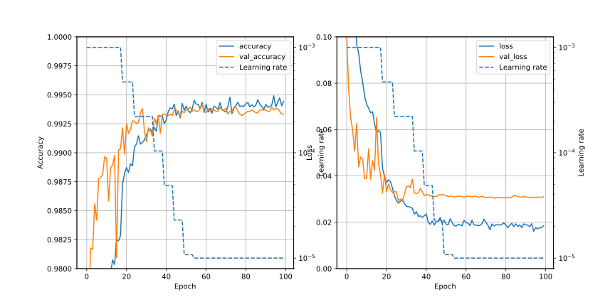

# CNN1k/Readme.md

## Summary
- Check accuracy and loss on each condition
- Scripts are based on CNN1g, which means
  - train data are generated in each epoch using ```keras.preprocessing.image.ImageDataGenerator()```
  - test data are same in each epoch, made by ```sklearn.model_selection.train_data_split()```
  - Parameters of ```ImageDataGenerator()``` parameters are as follows;
    - rotation_range=30,
    - width_shift_range=0.20,
    - height_shift_range=0.20,
    - shear_range=0.2,
    - zoom_range=0.2,
    - fill_mode='nearest'


## Data description

| dir | batch_size | Lr | BatchNomalization | Dropout | Min of val_loss | Max of val_accuracy | Score |
| :-: | :-:        |:-: | :-:               | :-: | :-: | :-: |:-:|
| 00  | 32 | default  | No | No | 0.03139 (epochs=14) | 0.99214 (epochs=33) | |
| 01  | 32 | ***Reducing*** | No | No | 0.02601 (epochs=32) | 0.99452 (epochs=33) | 0.99435 (epochs=32) |
| 02  | 32 | default  | ***Yes***| No | 0.03156 (epochs=39) | 0.99369 (epochs=39) |0.99235 (epochs=39)|
| 03  | 32 | default  | No | ***Yes (0.4)*** | 0.03247 (epochs=38) | 0.99167 (epochs=44) | |
| 04 | ***1024***| default  | No | No |0.03475 (epochs=45)|0.98977 (epochs=45)||
| 05 | 32 |  ***Reducing*** | No | No | 0.02909 (epochs=28) | 0.99417 (epochs=58) |0.99382 (epochs=28)|

### 00 ; standard
 default condition as of CNN1g

### 01 ; learning rate reducing
 ```keras.callbacks.ReduceLROnPlateau``` is used to reduce learning rate. Parameters are as follow.

 - monitor='val_loss'
 - factor=0.47
 - patience=5
 - min_lr=0.0001

 Initial learning rate of Adam optimizer is 0.001. So learning rate will change 0.001 -> 0.00047 -> 0.0002209 -> 0.000103823 .

### 02 ; BatchNormalization
 Based on "00", BatchNormalization is added after Conv2D.

### 03 ; Dropout
 Based on "00", Dropout(0.4) is added after Conv2D

### 04 ; Batch size 32 -> 1024
 batch_size is changed. Size of train_data is changed from 33600 (=42000 \* 0.8) to 33792 (= 1024 \* 33).

 ### 05 ; learning rate reducing (again)
  ```keras.callbacks.ReduceLROnPlateau``` is used to reduce learning rate. Parameters are as follow.

  - monitor='val_loss'
  - factor=0.47
  - patience=5
  - min_lr=0.00001

  Initial learning rate of Adam optimizer is 0.001. So learning rate will change 0.001 -> 0.00047 -> 0.0002209 -> 0.000103823 -> 0.00004879681 -> 0.0000229345007 -> 0.00001077921532 .

## Results
- 01, epochs=32 ; 0.99435 (331/2294 = 0.144)
- 02, epochs=39 ; 0.99235
- 05, epochs=28 ; 0.99382

## Graphs
### 00 ; standard


### 01 ; learning rate reducing


- When learning rate get smaller, val_accuracy raises and val_loss slightly reduces.

### 02 ; BatchNormalization


- Almost same as "00", not better than "01"

### 03 ; Dropout


- Slightly better than 00 (?). Seemed that training was not finished. More epochs will be needed (?)

### 04 ; Batch size 32 -> 1024


- Worse than 00, but seemed that training was not finished. More epochs will be needed (?)

### 05 ; learning rate reducing (again)


- After epochs=40, val_loss seeds unchanged.
