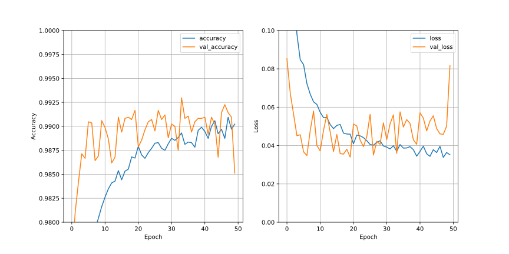
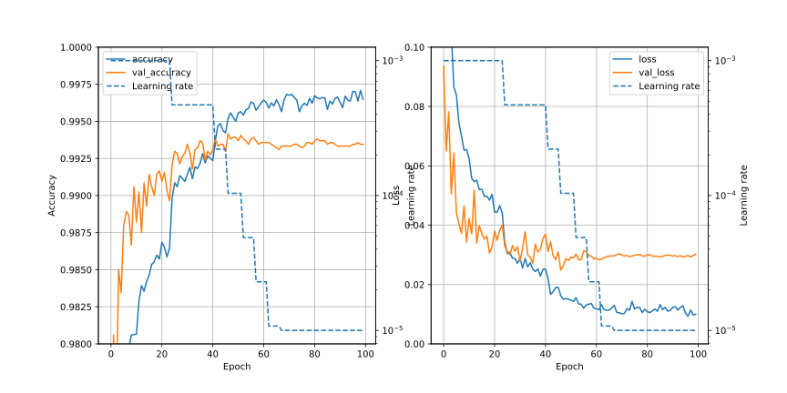
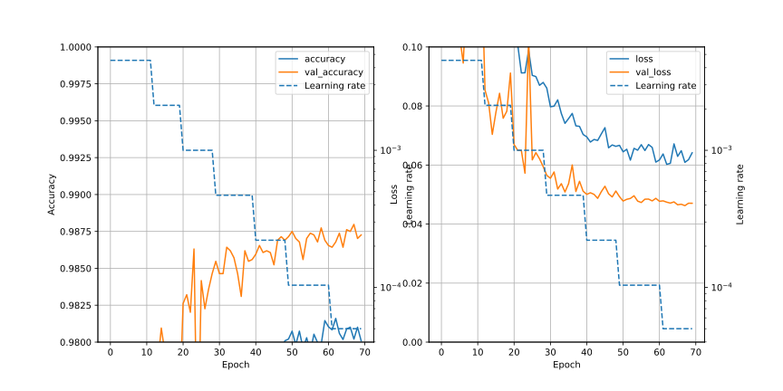
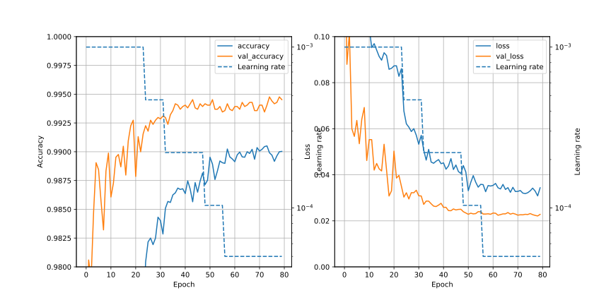
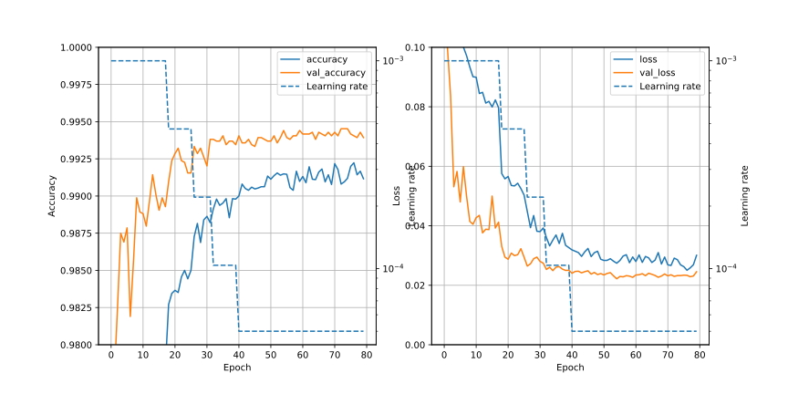

# CNN1l/Readme.md

## Summary
- Strategy ; get higher accuracy and lower loss by increasing parameters of neural network
- Based on CNN1k
- In order to increase parameters, 1st Conv2D is changed as follows;
  - Before ; model.add(layers.Conv2D(64, (5, 5), activation='relu', input_shape=(28, 28, 1)))
  - After ; model.add(layers.Conv2D(64, (7, 7), activation='relu', padding='same', input_shape=(28, 28, 1)))

## Training conditions and Results of score

| No | batch_size | Lr | BatchNomalization | Dropout | Min of val_loss | Max of val_accuracy | Score |
| :-: | :-:        |:-: | :-:               | :-: | :-: | :-: |:-:|
| 00  | 32 | default  | No | No | 0.03399 (epochs=20) | 0.99298 (epochs=34) | 0.99092 (epochs=20)|
| 01  | 32 | reducing  | No | No | 0.02485 (epochs=47) | 0.99417 (epochs=47) | 0.99389 (epochs=47)|
| 02  | 32 | reducing (initial=0.004257)| No | No | 0.04623 (epochs=68) | 0.98798 (epochs=68) | |
| 03  | 32 | reducing | No | Yes (0.4) | 0.02212 (epochs=79)| 0.99476 (epochs=75) | ***0.99450*** (epochs=63)|
| 04  | 32 | reducing | No | Yes (0.4) | 0.02218 (epochs=55)| 0.99452 (epochs=73) | 0.99407 (epochs=55)|


### 00 ; standard condition
Standard condition of CNN1l.

### 01 ; Learning Rate reducing
```keras.callbacks.ReduceLROnPlateau``` is used to reduce learning rate. Parameters are as follow.

- monitor='val_loss'
- factor=0.47
- patience=5
- min_lr=0.00001

Initial learning rate of Adam optimizer is 0.001. So learning rate will change 0.001 -> 0.00047 -> 0.0002209 -> 0.000103823 -> 0.00004879681 -> 0.0000229345007 -> 0.00001077921532 .

epochs are set to 100.

### 02 ; Learning Rate reducing (2)
- Initial learning rate ; 0.004257 (larger than default)
- Learning rate will change 0.004257 -> 0.0020 -> 0.00094 -> 0.00044 -> 0.00020 -> 0.000098 -> 0.000005

- Parameters of ```keras.callbacks.ReduceLROnPlateau``` are
  - monitor='val_loss',
  - factor=0.47,
  - patience=5,
  - min_lr=0.00005,
  - verbose=1

### 03 ; Learning Rate reducing + Dropout
- Based on 01 (Learning Rate reducing starting lr=0.001 (default))
- Set Dropout(0.4) after every Conv2D

### 04 ; Changing 2nd Conv2D layer
- Based on 03
- 2nd Conv2D layer
  - Before ; model.add(layers.Conv2D(128, (3, 3), activation='relu'))
  - After  ; model.add(layers.Conv2D(128, (5, 5), activation='relu'))

## Results of score
- 00, epochs=20 ; 0.99092
- 01, epochs=47 ; 0.99389
- 03
  - epochs=79 ; 0.99392
  - epochs=63 ; 0.99450 (316 / 2326 = 0.1358)
  - epochs=50 ; 0.99410
  - epochs=43 ; 0.99392
- 04
  - epochs=55 ; 0.99407

## Files

## Graphs
### 00 ; standard

- According to train data, accuracy is higher and loss is lower than CNN1h/00.
- "val_accuracy" and "val_loss" are not stable. The values of them are similar to those of CNN1h/00.

### 01 ; Learning Rate reducing

- It seems learning rate under 10^-4 does not work. In the begining, it might be larger learning rate is preferable (?)
- For the stable reduction of loss or val_loss, BatchNormalization may be work well.

## 02 ; Learning Rate reducing (2)

- Bad (accuracy is low and loss is high.)

## 03 ; Learning Rate reducing + Dropout

- val_loss is smaller than that of 01.

### 04 ; Changing 2nd Conv2D layer

