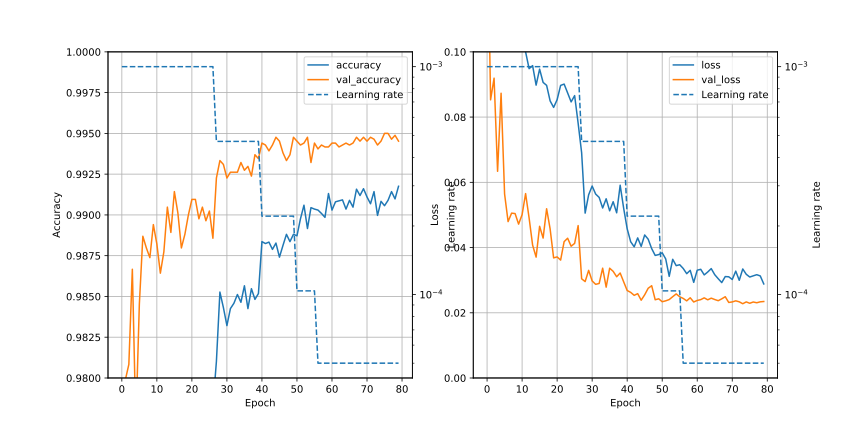

# CNN1m/Readme.md

## Summary
In the CNN1l, best conditions (06) are as follows;
- 1st Cond2D ; filter is 7x7
- Use learning rate reducing, starting lr=0.001
- Use dropout (0.4) after each Cond2D
- Channels are doubled in each Cond2D

The next strategy is also to increase complexity of CNN. Until now, Dense layer is same. Here, I will change Dense layer to get higher accuracy.

## Training conditions and Result of score
### Common conditions
- Batch size ; 32
- Lr ; reducing, starting 0.001, factor 0.47
- Dropout after Cond2D ; Yes (0.4)
- BatchNormalization after Cond2D ; No

### Training conditions
| No| Dense layer | Dropout (*) | BatchNormalization (*) | Min of val_loss | Max of val_accuracy | Score |
|:-:| :-: | :-: | :-: | :-: | :-: | :-: |
| 00| 1024 - 256 - 10 | No | No |0.02277 (epochs=74) |0.99500 (epochs=76) | |

(*) in Dense layers

## Detail
### 00
Standard condition of CNN1m. Dense(1028) is added.

## Results

## Graphs
### Reference (CNN1l/06)

### 00 (Standard condition)

