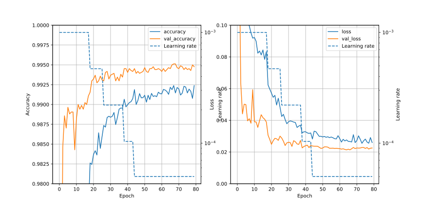
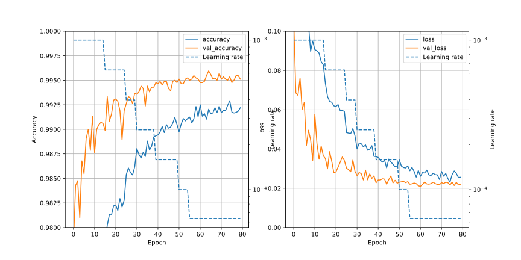
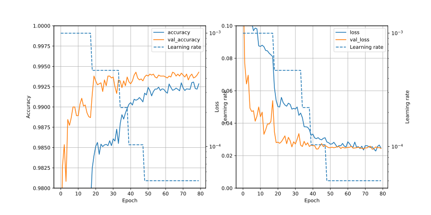
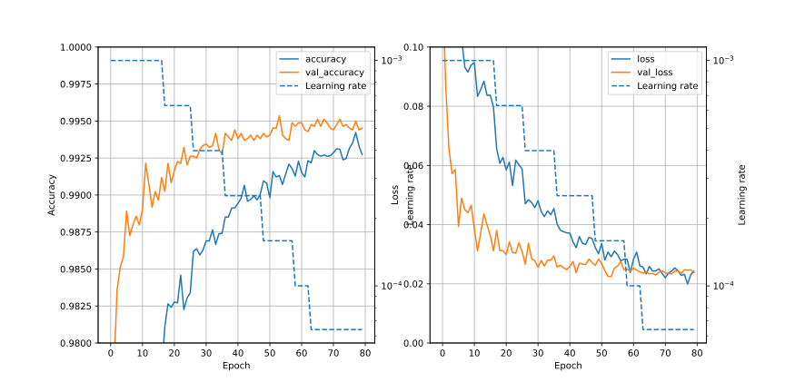

# CNN1n/Readme.md
In the CNN1l, best conditions (06) are as follows;
- 1st Cond2D ; filter is 7x7
- Use learning rate reducing, starting lr=0.001, factor=0.47
- Use dropout (0.4) after each Cond2D
- Channels are doubled in each Cond2D

Here, based on the condition of CNN1l/06, try various method.

# Training conditions and Result of score
### Common conditions
- Batch size ; 32
- Dropout after Cond2D ; Yes (0.4)
- BatchNormalization after Cond2D ; No

### Training conditions
| No| Conditions | Min of val_loss | Max of val_accuracy | Score |
|:-:| :-- | :-: | :-: | :-: |
|Ref| CNN1l/06 | 0.02138 (epochs=65)| 0.99512 (epochs=68) | 0.99507 (epochs=62)|
| 00| factor = 0.631 |0.02099 (epochs=61) |0.99595 (epochs=65) | 0.99475 (epochs=61)|
| 01| 00 + doubled channels|0.02247 (epochs=54)| 0.99536 (epochs=54)| 0.99482 (epochs=54) |

## Detail
### 00 ; learning rate reducing factor ; 0.47 -> 0.631
Factor of learning rate reducing is changed from 0.47 to 0.631

### 01 ; 00 + doubled channels of Conv2D (as in CNN1l/07)
Base is CNN1n/00 above, and channels of Cond2D are doubled (256 - 1024 - 1024).

## Results
- 00
  - epochs=61 ; 0.99475
  - epochs=60 ; 0.99450

- 01
  - epochs=54 ; 0.99482
  - epochs=53 ; 0.99439

## Graphs
### Reference (CNN1l/06)

### 00 ; learning rate reducing factor ; 0.47 -> 0.631

- Slightly improved comparing to CNN1l/06.

### Reference (CNN1l/07)

### 01 ; 00 + doubled channels of Conv2D (as in CNN1l/07)

