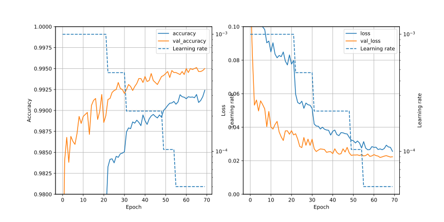
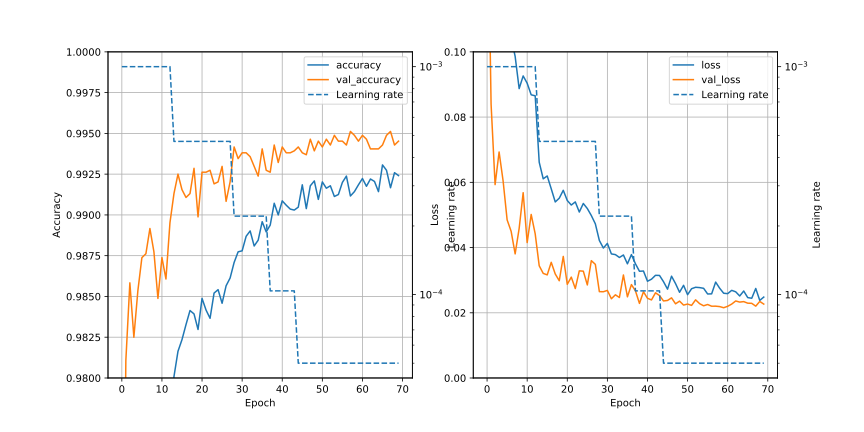
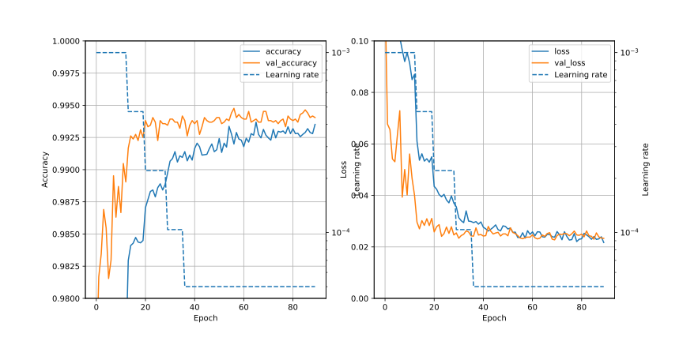

# CNN1o/Readme.md
In the CNN1l, best conditions (06) are as follows;
- 1st Cond2D ; filter is 7x7
- Use learning rate reducing, starting lr=0.001, factor=0.47
- Use dropout (0.4) after each Cond2D
- Channels are doubled in each Cond2D

Here, based on the condition of CNN1l/06, try "test time augumentation".

## Training conditions and Result of score
### Common conditions
- Batch size ; 32
- Dropout after Cond2D ; Yes (0.4)
- BatchNormalization after Cond2D ; No

### Training conditions
| No| Conditions | Min of val_loss | Max of val_accuracy | Score |
|:-:| :-- | :-: | :-: | :-: |
|Ref| CNN1l/06 | 0.02138 (epochs=65)| 0.99512 (epochs=68) | 0.99507 (epochs=62)|
| 00| TTA (epochs=5) | 0.02195 (epochs=64) |0.99512 (epochs=66) | 0.99467 (TTA) |
| 01| TTA (epochs=5) | 0.02154 (epochs=60) |0.99512 (epochs=58)| **0.99532** (epochs=60) |
| 02| filters=512 |  | |  |

## Detail
### 00 ; Test Time Augumentation (epochs=5), Saved as Ver.15 on Kaggle
- Test time augumentation is used. Epochs = 5.
- Accuracy score of train data: 0.9972380952380953

### 01 ; Test Time Augumentation (epochs=5), filters=256
- filters=256
- Accuracy score of train data: 0.9973095238095238

### 02 ; filters=512
- TTA is not used
- filters=512
- Accuracy score of train data: 0.9973095238095238

## Results
- 00
  - digit-recognizer_CNN1o_tta.csv ; 0.99467
  - epochs=64 ; 0.99407
  - epochs=59 ; 0.99425
  - not better than CNN1l/06
- 01
  - digit-recognizer_CNN1o_tta.csv ; 0.99500
  - epochs=60 ; 0.99532 (257 / 2254 = 0.1140)

## Graphs
### Reference (CNN1l/06)

### 00 ; Test Time Augumentation (epochs=5)

### 01 ; Test Time Augumentation (epochs=5), filters=256

### 02 ; filters=512

