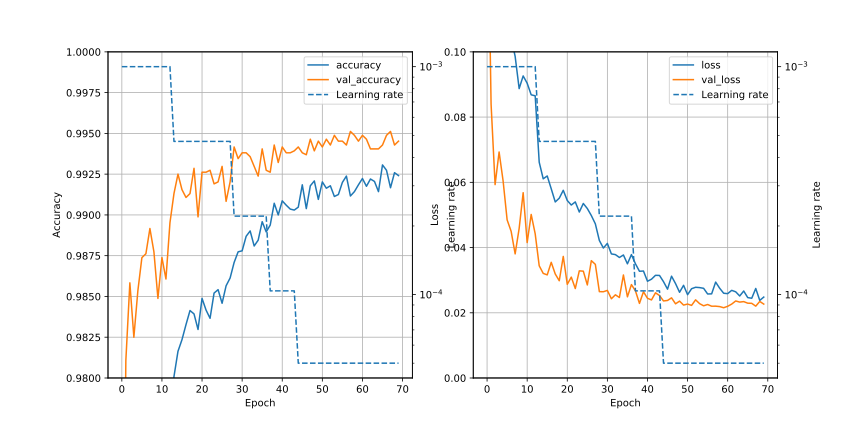

# CNN1p/Readme.md

## Summary
In CNN1o, No.01 was the best. Based on it, ensemble training is tried to get higher score.

## Training conditions and Result of score
| No| Conditions | Min of val_loss | Max of val_accuracy | Score |
|:-:| :-- | :-: | :-: | :-: |
| Ref | filters=256 | 0.02154 (epochs=60) |0.99512 (epochs=58) | 0.99532 (epochs=60) |
| 00  | epochs=5    |                     |                    | **0.99553** (soft)  |
| 00  | epochs=5    |                     |                    | 0.99528 (hard)  |

## Detail
### 00 ; ensamble training (5-fold), filters=256, Saved as Ver.16 on Kaggle

## Results
- 00
  - soft emsamble = 0.99553 (245 / 2583 = 0.09485)
  - hard emsamble = 0.99528

### Ref ; filters=256

## Misc
- corrcoef.txt ; correlation coefficient of hard ensamble
