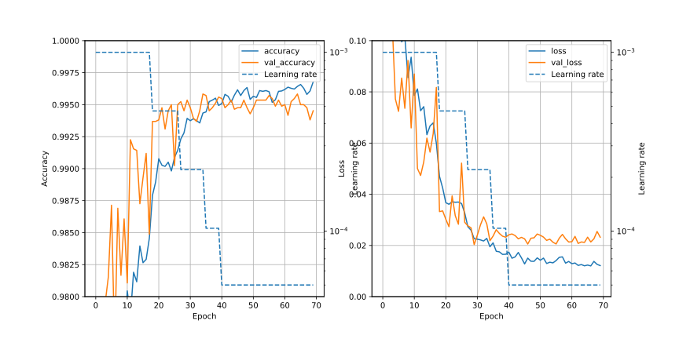
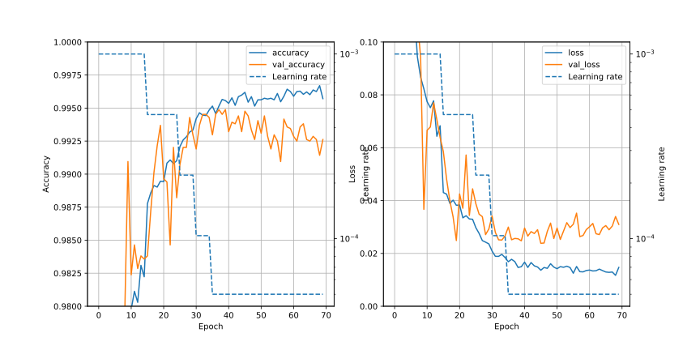

# CNN1q/Readme.md

## Summary
- VGG16-like deep models are tried.

## Training conditions and Result of score
| No| Conditions | Min of val_loss | Max of val_accuracy | Score |
|:-:| :-- | :-: | :-: | :-: |
| Ref | filters=256 | 0.02154 (epochs=60) |0.99512 (epochs=58) | 0.99532 (epochs=60) |
| Ref | CNN1p/00    |                     |                    | **0.99553** (soft)  |
| 00  | n_layers=2, filters=128 |                     |                    | 0.99435 (epochs=30)|
| 01  | n_layers=2, filters=128 | 0.02382 (epochs=46) | 0.99488 (epochs=38)| 0.99285 (epochs=46)|

## Detail
### 00 ; n_layers=2, filters=128

### 01 ; n_laysers=2, filters=128 (Same as 00)
- Same condition as 00, but watch `loss` to save data.

### 02 ; condition is same as 01 + ensamble training (epochs=5), saved as Ver.17 on Kaggle
- Same condition as 01, and ensamble training is used.

## Results
- 00
  - epochs=30 ; 0.99435
- 01
  - epochs=46 ; 0.99285
- 02
  - soft ensamble ; 0.99510

## graphs
### Ref ; filters=256

### 00 ; n_laysers=2, filters=128

- `val_loss` is not stable. So it seems better to check `loss` instead of `val_loss`.

### 01 ; n_laysers=2, filters=128 (Same as 00)

- When epochs > 40, seems over-fit.
