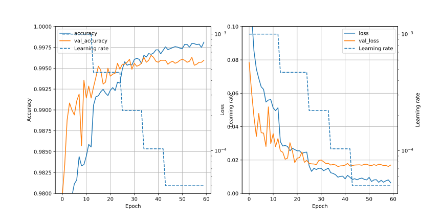

# CNN1r/Readme.md

## Summary / 要約
1. Train and predict as usual.
2. Re-train the model using train data of low predict probability, and re-predict the label of test data of low probability


1. 普通に学習と予測を行う
2. 予測の確率が低い訓練データを使って再学習し, 確率の低いテストデータの再予測をする

## Preparation / 準備
### Probabilities of right answers and wrong answers / 正しい答えと間違った答えの確率


- 青い線 ; 正しい答えに対する確率
- 赤い線 ; 予測された確率 (`tf.keras.Sequential.predict_proba()`)のうち最大のもの

グラフは, 正しい答えに対する確率 (青い線の値) で逆順にソートしている. 確率が 0.5 を下回ると, 誤答が増えてくる. 自信を持って間違えている (赤い線の値が高い) 場合と, 迷っている (青い線と赤い線が同じくらいの値) 場合があることが分かる.

訓練データは答えが分かっているので, 正しい答えに対する確率が低い画像を識別できる. しかしテストデータは (当たり前だが) 正答が分からないので, テストデータから間違っていそうなデータだけ抽出して再予測することはできない.

対策として考えられるのは,

- 最大の確率が例えば 0.8 以下の全ての画像に対して, 再予測する
- 全部のテストデータに対して再予測し, 1 回目の予測結果とアンサンブル学習をする

### 確率の低い画像データ


正しい答えに対する確率が低いほうから, 150 個のデータを示す。左上が確率が高いほう, 右下が確率が低いほうで, 画像の上の数字は, 左側が正しい答え, 右側が確率が最大だった答え.

これらの画像データで学習すれば, これらの画像データに対する正答率は向上する. しかし, もともと確率が高かった正答の画像を, 誤った結果にしてしまう危険性もある.

### 確率の低いデータのラベルの分布


正答の確率の低い画像データ (低いほうから 150 個) で, ラベルごとの個数をプロット. x 軸は正答のラベル, y 軸は個数. 1, 4, 7, 9 のデータで, 誤りが多い.

### まとめ
- 予測を間違ったテストデータのみを抽出することはできないので, 再予測する場合は
  - 最大の確率が例えば 0.8 以下のすべての画像に対して再予測する
    - この場合，自信を持って間違えているデータは, 間違えたまま (あきらめ)
  - 全部のテストデータに対して再予測し, 1 回目の予測結果とアンサンブル学習をする
    - 例えば最初の予測で 3 回分, 再予測で 2 回分, 合計 5 回分のデータでアンサンブルするなど, 最初の予測の重みを重めにするなど, 工夫が必要か

## 再予測の条件の検討
### 転移学習の条件と, 損失関数

#### Freeze = none


#### Freeze = layer1


#### Freeze = layer1, layer2


#### Freeze = layer1, layer2, layer3


#### まとめ
- Freeze = none ; accuracy, loss が改善しすぎていて, 過学習になっている
- Freeze = layer1 ; ちょうどいい感じ
- Freeze = layer1, layer2 (, layer3) ; accuracy が不足. 複雑さを表現しきれていない

以上から Freeze = layer1 とする.

(後日の考察) でも, `val_loss` の値だけを素直にみると, Freeze = none のほうが `val_loss` の値が良い. Freeze しないほうが良いのかも.

### epoch 数


Freeze = layer1 とし, epochs=150 で計算. epochs=100 くらいで改善が止まっている感じ.

### まとめ
転移学習は, Freeze = layer1 とし, epochs = 100 とする.

## 00
### Summary
- 通常の学習と, 確率の低い画像データを使って転移学習 (条件は上記)
- 通常の学習と転移学習を各 5 回ずつ行い, 各結果を 0 ～ 5 個ずつ使ってアンサンブル学習
- This script is saved as Ver.19 on kaggle.

### train_data の予測結果


1st training を 5 回, transfer training を 3 回使って ensamble training (soft) が一番良かった. 次は 1st training を 5 回, transfer training を 4 回使って ensamble training (soft).

### Results
|1st training|Transfer training|Soft/Hard|Score|No|
|:-:|:-:|:-:|:-:|:-:|
| 5 | 3 | Soft | 0.99571 | 239 / 2950 |
| 5 | 4 | Soft | 0.99578 | 231 / 2950 (=0.0783)|
| 5 | 5 | Soft | 0.99575 | |
| 5 | 0 | Soft | 0.99528 | |

### Transfer training の成果は出ているのか?
スコアが上がったのは, 単に ensamble するデータが増えただけではないか? の検証 (データは全て soft ensamble)

|Ensamble No|1st training|Transfer training|Score|
|:-:|:-:|:-:|:-:|
| 6 | 5 | 1 | 0.9977619047619047 |
| 6 | 4 | 2 | **0.9978095238095238** |
| 6 | 3 | 3 | 0.9977857142857143 |
| 6 | 2 | 4 | 0.9958571428571429 |

微妙だが, データセット数 = 6 のとき, 1st training を 4 回, Transfer training を 2 回のときが, 一番スコアが良い.

下記に相関係数を示すが, 1st training どうしは 0.995, 1st training と Transfer training は 0.954, Transfer training どうしは 0.963 となっており, わずかではあるが相関係数は低いので, ensamble の効果はあるはず.

```
5-1
[[1.         0.99511309 0.9945586  0.99540225 0.99538242 0.95392299]
 [0.99511309 1.         0.99518185 0.99484475 0.99467612 0.95462115]
 [0.9945586  0.99518185 1.         0.99513058 0.99418213 0.95508154]
 [0.99540225 0.99484475 0.99513058 1.         0.99517363 0.95427125]
 [0.99538242 0.99467612 0.99418213 0.99517363 1.         0.95446136]
 [0.95392299 0.95462115 0.95508154 0.95427125 0.95446136 1.        ]]

 4-2
 [[1.         0.99511309 0.9945586  0.99540225 0.95392299 0.9526449 ]
  [0.99511309 1.         0.99518185 0.99484475 0.95462115 0.95334551]
  [0.9945586  0.99518185 1.         0.99513058 0.95508154 0.95259153]
  [0.99540225 0.99484475 0.99513058 1.         0.95427125 0.95251388]
  [0.95392299 0.95462115 0.95508154 0.95427125 1.         0.9634931 ]
  [0.9526449  0.95334551 0.95259153 0.95251388 0.9634931  1.        ]]
```  

## 01
### Summary
`ImageDataGenerator` のパラメータをランダムサーチで最適化する.

### 計算
- 1 epoch = 20s
- 1 条件の計算は 70 epochs = 1400s (23.34min) (本番の計算は 65 epochs にした)

### Files
- history_ImageDataGenerator.csv ; accuracy and loss of optimal condition
- results_ImageDataGenerator.csv ; parameters of ImageDataGenerator and val_loss
  - val_loss の大きい条件と小さい条件は存在するようだ

### 9 回繰り返した中での最適の accuracy と loss


## 02
### Summary
- `GPyOpt` を使って，`ImageDataGenerator` のパラメータの最適値を探す

### Files
- myBopt.csv
  - 1 回目の最適化. `horizontal_flip` と `vertical_flip` も変数にした.
  - 結局のところ, `horizontal_flip = False`, `vertical_flip = False` のほうが良かった
- myBopt2.csv
  - 2 回目の最適化. `horizontal_flip = False`, `vertical_flip = False` として合計 20 回計算
  - 結果として, パラメータの振り幅を小さくするのが良いという, 「そう言われればそうだよね」という結果が出た。ただそれだと, 過学習か否かの判断がつかない.
  - 過学習を防ぎつつ, `val_loss` を防ぐには, ランダムサーチにして, 損失関数を見ながら, 最適の値を探しに行くのが良いか?

## 03
### Summary
- ランダムサーチで `ImageDataGenerator` のパラメータの最適化をする
- 00 と同様に, 通常の学習と, 確率の低い画像データを使って転移学習 (条件は上記)
- 通常の学習と転移学習を各 5 回ずつ行い, 各結果を 0 ～ 5 個ずつ使ってアンサンブル学習
- (This script is saved as Ver.19 on kaggle.)

### ImageDataGenerator のランダムサーチ
history 以下のファイルは, `ImageDataGenerator` のランダムサーチの結果. `val_loss` が一番小さかったのは, 以下の組み合わせ (カッコ内は従来の数値)

- rotation_range = 11 (30)
- width_shift_range = 0.13 (0.20)
- height_shift_range = 0.25 (0.20)
- shear_range = 0.37 (0.20)
- zoom_range = 0.17 (0.20)

### ImageDataGenerator のパラメータ変更後の損失関数


`val_loss` が 0.02 を切るようになっている. (全てが 0.02 を切っているわけではないが)

### train_data の予測結果


00 と違って, 転移学習の結果を入れすぎると, 精度が下がる. 通常学習を 5, 転移学習を 0, 1, 2 が一番良い.
soft と hard の違いはあまりない.

### Results
|1st training|Transfer training|Soft/Hard|Score|No|
|:-:|:-:|:-:|:-:|:-:|
| 5 | 0 | Soft | 0.99578 |  |
| 5 | 0 | Hard | 0.99607 | 166 / 2223 (=0.0746) |
| 5 | 1 | Soft | 0.99582 |  |
| 5 | 1 | Hard | 0.99592 |  |
| 5 | 2 | Soft | 0.99603 |  |
| 5 | 2 | Hard |  |  |

## 04
### Summary
- 03 では, 転移学習の結果を入れすぎると, アンサンブル学習の結果が悪化した
- そこで転移学習のパラメータを見直して, アンサンブル学習の精度の向上を図る

### retraining_parameter/
- loss_layer1_32_32_5.png ; Freeze=layer1, データ数 32x5x5
- loss_layer1_32_32_10.png ; Freeze=layer1, データ数 32x5x10
- loss_none_32_32_5.png ; Freeze=none, データ数 32x5x5
- loss_none_32_32_10.png ; Freeze=none, データ数 32x5x10


上の結果は, Freeze=none, データ数 32x5x5 の結果である. データ数が多いほうが `val_loss` は小さくなるが, それは予想しやすいデータが多く含まれるからであって, 精度の悪いデータの割合が大きくなれば `val_loss` は大きくなる. そこで, 上記の結果を採用した.

なお, 本番では転移学習では `epoch=70` とした.

### result/


精度が高いのは,
- soft ; 通常学習を 5, 転移学習を 2 or 3 (soft > hard)
- hard ; 通常学習を 5, 転移学習を 0

### Results
|1st training|Transfer training|Soft/Hard|Score|No|
|:-:|:-:|:-:|:-:|:-:|
| 5 | 1 | Soft | 0.99639 |  |
| 5 | 2 | Soft | 0.99642 | 139 / 2248 |
| 5 | 3 | Soft | **0.99650** | 134 / 2248 (=0.0596) |
| 5 | 0 | Hard | 0.99614 |  |

## 05
### Summary
`ImageDataGenerator` の最適値を再考する.

### File
- image_data_generator.xcf ; `ImageDataGenerator` の各パラメタの効果を確認
- image_data_generator.png ; 上記ファイルのエクスポート

上記の結果を見ると `shear_range` の値の考え方を間違えていた感じがする (**角度** を指定しなければならない)

### Randomized search
`shear_range` を 10 ～ 50 にして，再度ランダムサーチ。結果は以下の通り。

- rotation_range       ; 10
- width_shift_range    ; 0.12476082129739381
- hight_shift_range    ; 0.27554495158231596
- shear_range          ; 10
- zoom_range           ; 0.1780711622606244
- val_loss             ; 0.02022068202495575

`rotation_range`  と `shear_range` は小さい値になっている。これらの範囲を **0 ～ 50** とかでランダムサーチしたほうが良いかもしれない.

### history


## 06
- ゼロを含む範囲で, 再度ランダムサーチ (Saved as Ver.20)

### Randomized search results
- rotation_range       ; 3
- width_shift_range    ; 0.18476589453870554
- hight_shift_range    ; 0.08195407483163591
- shear_range          ; 9
- zoom_range           ; 0.20833999432357256
- val_loss             ; 0.021102938801050186

### history


`ImageDataGenerator` のパラメタの値が全体的に小さく, 結果として過学習になっている.

`rotation_range` と `shear_range` は 0 に固定して, 他のパラメータを振ったほうが良いか?

## 07
- `width_shift_range` と `height_shift_range` だけ変えて，グリッドサーチ。
- rotation_range と shear_range は 5
- 結果は，変化が一番小さいものが良かった
  - rotation_range ; 5
  - width_shift_range ; 0.1
  - height_shift_range ; 0.1
  - shear_range ; 5
  - zoom_range ; 0.17
  - val_loss ; 0.01939011737704277


## 08
- `width_shift_range` と `height_shift_range` だけ変えて，グリッドサーチ。
- rotation_range と shear_range は 2.5 に小さくした
- 最適値
  - rotation_range ; 2.5
  - width_shift_range ; 0.2
  - height_shift_range ; 0.1
  - shear_range ; 2.5
  - zoom_range ; 0.17
  - val_loss ; 0.019082391634583473

  

- 考察
  - val_accuracy は 08 のほうが良い
  - val_loss の低下のスピードは 07 のほうが早い。でも絶対値的には 08 のほうが僅かに良い

## 09
- 08 で得られたパラメータで, 学習・推定を行う
  - rotation_range ; 2.5
  - width_shift_range ; 0.2
  - height_shift_range ; 0.1
  - shear_range ; 2.5
  - zoom_range ; 0.17

- low_proba_index.png ; 正解に対する確率のプロット. 42000 データ中, 41900 以上で正解がでており, 1 回目での学習精度は上がっている (ImageDataGenerator の変形を抑制しているので, 当たり前といえば当たり前)


### 32x5x5
- 2 回目の学習のデータ数を 32x5x5 にしたときの結果

#### 1 回目の学習


上記は 1 回目の学習時の損失関数の 1 つ. `val_loss` が 0.02 を下回っている (全てが 0.02 を下回っているわけではない)

#### アンサンブル学習の結果


- hard ensamble ; 通常学習を 5 回, 転移学習を 0 ～ 2 のときに最大 (0.999357, 転移学習の効果が出ていない)
- soft ensamble ; 通常学習を 5 回, 転移学習を 2 回のときに最大 (0.999404, hard よりも高い)

### 32x5x2
- 2 回目の学習のデータ数を 32x5x2 にしたときの結果

#### アンサンブル学習の結果


- hard ensamble ; 通常学習を 4 回, 転移学習を 1 回のときに最大 (0.999452)
- soft ensamble ; 通常学習を 4 回, 転移学習を 2 回のときに最大 (0.999476)

### Results
|1st training|Transfer training|#data of transfer training|Soft/Hard|Score|No|
|:-:|:-:|:-:|:-:|:-:|:-:|
| 4 | 2 | 32x5x2 | Soft | 0.99592 | |
| 4 | 2 | 32x5x2 | Hard | 0.99542 | |
| 5 | 2 | 32x5x2 | Soft | 0.99617 | |
| 5 | 2 | 32x5x5 | Soft | 0.99614 | |
| 5 | 2 | 32x5x5 | Hard | 0.99585 | |

0.996 台のいい数字が出ているが, 過去を越えられない. ImageDataGenerator による変形抑制による, 過学習になているのか?

## 10
- 07 で得られたパラメータで, 学習・推定を行う
  - rotation_range ; 5
  - width_shift_range ; 0.1
  - height_shift_range ; 0.1
  - shear_range ; 5
  - zoom_range ; 0.17

  - low_proba_index.png ; 正解に対する確率のプロット. 09 よりも僅かだが正答率が上がっている

  

### 32x5x5
- 2 回目の学習のデータ数を 32x5x5 にしたときの結果

#### 1 回目の学習結果


1 回目の学習の損失関数の一例. `val_loss` が 0.02 を下回っている (全てで 0.02 を下回っている訳ではない)

#### アンサンブル学習の結果


- hard ensamble ; 通常学習を 5 回, 転移学習を 0 回のときに最大 (0.999666, 転移学習の効果が出ていない). 通常学習を 5 回, 転移学習 2 回もいい感じ (0.999642)
- soft ensamble ; 通常学習を 5 回, 転移学習を 1 回のときに最大 (0.999642, hard よりも若干低い). 次点は通常学習 5 回, 転移学習 0 or 2 回 (0.999619)

### 32x5x2
- 2 回目の学習のデータ数を 32x5x2 にしたときの結果

#### アンサンブル学習の結果


- hard ensamble ; 通常学習を 5 回, 転移学習を 0 回のときに最大 (0.999666, 転移学習の効果が出ていない)
- soft ensamble ; 通常学習を 5 回, 転移学習を 0 or 1 回のときに最大 (0.999619)

### 32x5x1
- 2 回目の学習のデータ数を 32x5x1 にしたときの結果 (アンサンブルの効果が出ていないので, データ数を減らして, 不正解のデータの割合を増やした)

#### アンサンブル学習の結果


- hard ensamble ; 通常学習を 5 回, 転移学習を 0 or 1 回のときに最大 (0.999547, 転移学習の効果が出ていない)
- soft ensamble ; 通常学習を 5 回, 転移学習を 0 or 1 回のときに最大 (0.999571, 転移学習の効果が出ていない)

### 考察
- アンサンブル学習の効果を見ると, 転移学習のデータ数が 32x5x5 のときにアンサンブル学習の効果が出ている (32x5x2 や 32x5x1 はアンサンブル学習の効果がイマイチ). 転移学習のデータ数が多いということは, 予測をミスったデータの影響が少ないということなので, 32x5x5 のアンサンブル学習の効果は, 単にアンサンブル学習に使うネットワークが増えているためであるのかもしれない.

## テスト
### フォルダ
- [test](./test/)

### ファイル
- CNN1r_a.svg, CNN1r_b.svg ; 2 回目の学習の結果


学習結果を見ると, `loss` の減少は続いているが `val_loss` の減少は途中で止まっている. 過学習になっている可能性がある. オンラインでグラフを見ながらパラメータを調整する必要がある.

## time
時間関連の関数のテスト. ある一定時間で `while` 抜ける実験

### フォルダ
- [time](./time/)

## gpyopt
GPyOpt のテスト.

### フォルダ
- [gpyopt](./gpyopt/)
